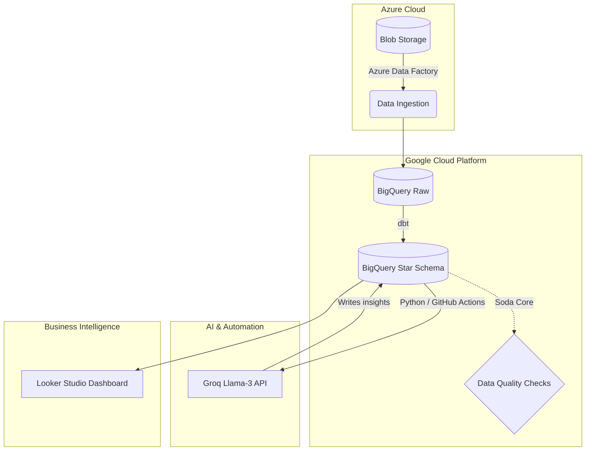
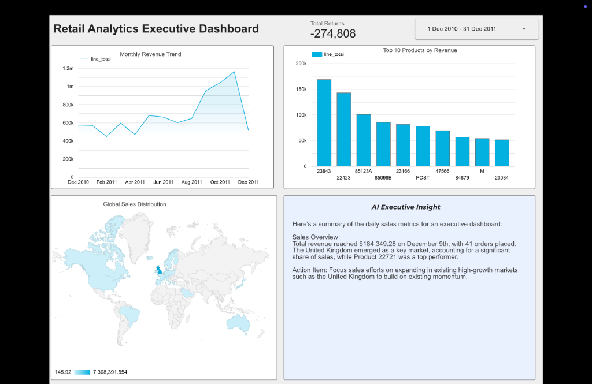

# Retail Analytics Pipeline

An end-to-end retail analytics platform built on Azure and GCP.

## Architecture

## Stack
- **Ingestion**: Azure Data Factory + Azure Blob Storage
- **Warehouse**: Google BigQuery
- **Transformation**: dbt (star schema)
- **Data Quality**: Soda Core
- **LLM Layer**: Groq Llama-3
- **Dashboard**: Looker Studio

## Pipeline
1. ADF Data Flow ingests OnlineRetail.csv from Blob Storage
2. Null CustomerIDs removed, InvoiceDate parsed to TIMESTAMP
3. Processed CSV staged in Blob Storage
4. Python script loads 406,829 rows into BigQuery raw_invoices
5. dbt builds star schema: stg_invoices → dim_products, dim_customers, fct_sales
6. Soda runs 7 data quality assertions
7. Groq Llama-3 generates daily executive summaries
8. Looker Studio dashboard visualizes 4 key metrics

## dbt Models
- `stg_invoices` — cleaned, filtered staging layer
- `dim_products` — product dimension with avg price and units sold
- `dim_customers` — customer dimension with purchase history
- `fct_sales` — fact table with line-level sales data

## Soda Checks
- No missing CustomerIDs
- Quantity within expected range
- Table not empty
- All staging quantities positive
- All staging prices positive

## Dashboard

[View Dashboard]
